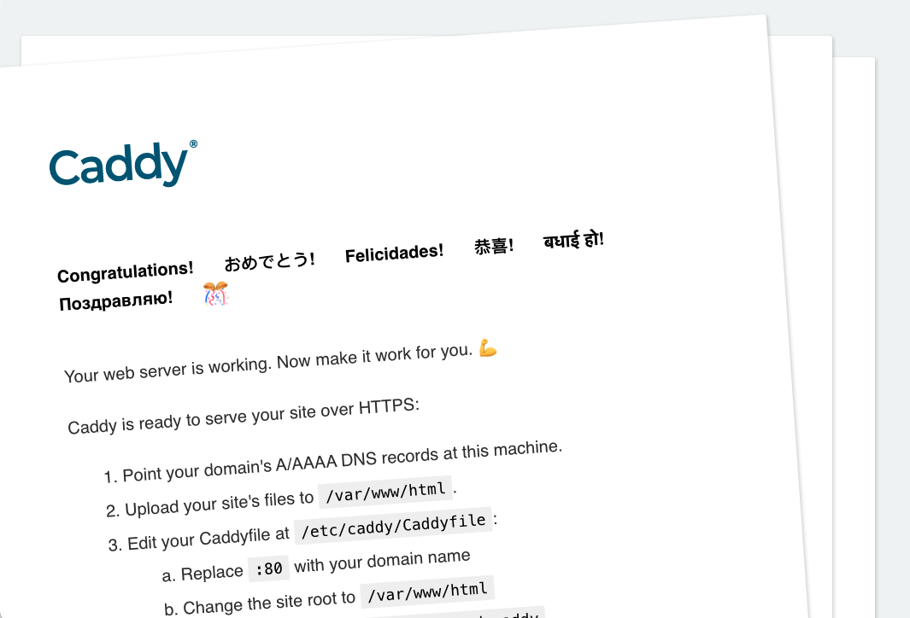
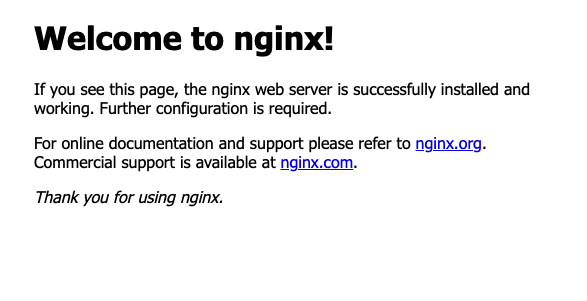

# Serving over HTTP on Digital Ocean

### 1. Setup and install docker
- See install_docker.md

### 2. Configure UFW to allow http connections
- See ufw.md

### 3. Use docker run command to run containers
- The official caddy image ships with a default Caddyfile at /etc/caddy/Caddyfile
- The official nginx image ships with a default .conf file at /etc/nginx/conf.d/default.conf
- Both config files only listen on port 80
- These default setup won't support https connections even if you allowed them via ufw.
- For example...in the caddy logs you'd still see: *server is listening only on the HTTP port, so no automatic HTTPS will be applied to this server*
- CADDY
  - docker run -p 80:80 caddy
- NGINX
  - docker run -p 80:80 nginx

### 4. Get the IP address from the droplet and connect via browser over http
- You see one of the following:

